# PHPStorm Debugging Guide

- [Intro](#Intro)
- [Installation](#Installation)
    - [Customize laradock/docker-compose.yml](#CustomizeDockerCompose) 
        - [Clean House](#InstallCleanHouse) 
        - [LaraDock Dial Tone](#InstallLaraDockDialTone) 
        - [hosts](#AddToHosts) 
        - [Firewall](#FireWall) 
        - [Enable xDebug on php-fpm](#enablePhpXdebug)
    - [PHPStorm Settings](#InstallPHPStorm)
        - [Configs](#InstallPHPStormConfigs)
- [Usage](#Usage)
    - [Laravel](#UsageLaravel) 
        - [Run ExampleTest](#UsagePHPStormRunExampleTest) 
        - [Debug ExampleTest](#UsagePHPStormDebugExampleTest) 
        - [Debug Web Site](#UsagePHPStormDebugSite) 
- [SSH into workspace](#SSHintoWorkspace) 
    - [KiTTY](#InstallKiTTY) 
    
<a name="Intro"></a>
## Intro

Wiring up [Laravel](https://laravel.com/), [LaraDock](https://github.com/LaraDock/laradock) [Laravel+Docker] and [PHPStorm](https://www.jetbrains.com/phpstorm/) to play nice together complete with remote xdebug'ing as icing on top! Although this guide is based on `PHPStorm Windows`, 
you should be able to adjust accordingly. This guide was written based on Docker for Windows Native.

<a name="Installation"></a>
## Installation

- This guide assumes the following:
    - you have already installed and are familiar with Laravel, LaraDock and PHPStorm. 
    - you have installed Laravel as a parent of `laradock`. This guide assumes `/c/_dk/laravel`. 

<a name="AddToHosts"></a>
## hosts
- Add `laravel` to your hosts file located on Windows 10 at `C:\Windows\System32\drivers\etc\hosts`. It should be set to the IP of your running container. Mine is: `10.0.75.2`
On Windows you can find it by opening Windows `Hyper-V Manager`.
    - 
        
- [Hosts File Editor](https://github.com/scottlerch/HostsFileEditor) makes it easy to change your hosts file.
    - Set `laravel` to your docker host IP. See [Example](photos/SimpleHostsEditor/AddHost_laravel.png).


<a name="FireWall"></a>
## Firewall
Your PHPStorm will need to be able to receive a connection from PHP xdebug either your running workspace or php-fpm containers on port 9000. This means that your Windows Firewall should either enable connections from the Application PHPStorm OR the port. 

- It is important to note that if the Application PHPStorm is NOT enabled in the firewall, you will not be able to recreate a rule to override that.
- Also be aware that if you are installing/upgrade different versions of PHPStorm, you MAY have orphaned references to PHPStorm in your Firewall! You may decide to remove orphaned references however in either case, make sure that they are set to receive public TCP traffic.

### Edit laradock/docker-compose.yml
Set the following variables:
```
### Workspace Utilities Container ###########################

    workspace:
        build:
            context: ./workspace
            args:
                - INSTALL_XDEBUG=true
                - INSTALL_WORKSPACE_SSH=true
                ...
                
                
### PHP-FPM Container #######################################

    php-fpm:
        build:
            context: ./php-fpm
            args:
                - INSTALL_XDEBUG=true
                ...
                
```

### Edit xdebug.ini files
- `laradock/workspace/xdebug.ini`
- `laradock/php-fpm/xdebug.ini`

Set the following variables:
```
xdebug.remote_autostart=1
xdebug.remote_enable=1
xdebug.remote_connect_back=1
xdebug.cli_color=1
```


<a name="InstallCleanHouse"></a>
### Need to clean house first?
Make sure you are starting with a clean state. For example, do you have other LaraDock containers and images?
Here are a few things I use to clean things up.

- Delete all containers using `grep laradock_` on the names, see: [Remove all containers based on docker image name](https://linuxconfig.org/remove-all-containners-based-on-docker-image-name). 
`docker ps -a | awk '{ print $1,$2 }' | grep laradock_ | awk '{print $1}' | xargs -I {} docker rm {}`

- Delete all images containing `laradock`.
`docker images | awk '{print $1,$2,$3}' | grep laradock_ | awk '{print $3}' | xargs -I {} docker rmi {}`
**Note:** This will only delete images that were built with `LaraDock`, **NOT** `laradock/*` which are pulled down by `LaraDock` such as `laradock/workspace`, etc.
**Note:** Some may fail with: 
`Error response from daemon: conflict: unable to delete 3f38eaed93df (cannot be forced) - image has dependent child images`

- I added this to my `.bashrc` to remove orphaned images.
    ```
    dclean() {
        processes=`docker ps -q -f status=exited`
        if [ -n "$processes" ]; thend
          docker rm $processes
        fi
    
        images=`docker images -q -f dangling=true`
        if [ -n "$images" ]; then
          docker rmi $images
        fi
    }
    ```

- If you frequently switch configurations for LaraDock, you may find that adding the following and added to your `.bashrc` or equivalent useful:
```
# remove laravel* containers
# remove laravel_* images
dcleanlaradockfunction()
{
	echo 'Removing ALL containers associated with laradock'
	docker ps -a | awk '{ print $1,$2 }' | grep laradock | awk '{print $1}' | xargs -I {} docker rm {}

	# remove ALL images associated with laradock_
	# does NOT delete laradock/* which are hub images
	echo 'Removing ALL images associated with laradock_'
	docker images | awk '{print $1,$2,$3}' | grep laradock_ | awk '{print $3}' | xargs -I {} docker rmi {}

	echo 'Listing all laradock docker hub images...'
	docker images | grep laradock

	echo 'dcleanlaradock completed'
}
# associate the above function with an alias
# so can recall/lookup by typing 'alias'
alias dcleanlaradock=dcleanlaradockfunction
```

<a name="InstallLaraDockDialTone"></a>
#### Let's get a dial-tone with Laravel

```
# barebones at this point
docker-compose up -d nginx mysql

# run 
docker-compose ps

# Should see:
          Name                        Command             State                     Ports
-----------------------------------------------------------------------------------------------------------
laradock_mysql_1            docker-entrypoint.sh mysqld   Up       0.0.0.0:3306->3306/tcp
laradock_nginx_1            nginx                         Up       0.0.0.0:443->443/tcp, 0.0.0.0:80->80/tcp
laradock_php-fpm_1          php-fpm                       Up       9000/tcp
laradock_volumes_data_1     true                          Exit 0
laradock_volumes_source_1   true                          Exit 0
laradock_workspace_1        /sbin/my_init                 Up       0.0.0.0:2222->22/tcp


```

<a name="enablePhpXdebug"></a>
#### Enable xDebug on php-fpm
In a host terminal sitting in the laradock folder, run: `./xdebugPhpFpm status`
You should see something like the following:
```
xDebug status
laradock_php-fpm_1
PHP 7.0.9 (cli) (built: Aug 10 2016 19:45:48) ( NTS )
Copyright (c) 1997-2016 The PHP Group
Zend Engine v3.0.0, Copyright (c) 1998-2016 Zend Technologies
    with Xdebug v2.4.1, Copyright (c) 2002-2016, by Derick Rethans
```
Other commands include `./xdebugPhpFpm start | stop`.

If you have enabled `xdebug=true` in `docker-compose.yml/php-fpm`, `xdebug` will already be running when
`php-fpm` is started and listening for debug info on port 9000.


<a name="InstallPHPStormConfigs"></a>
#### PHPStorm Settings
- Here are some settings that are known to work:
    - `Settings/BuildDeploymentConnection`
        - 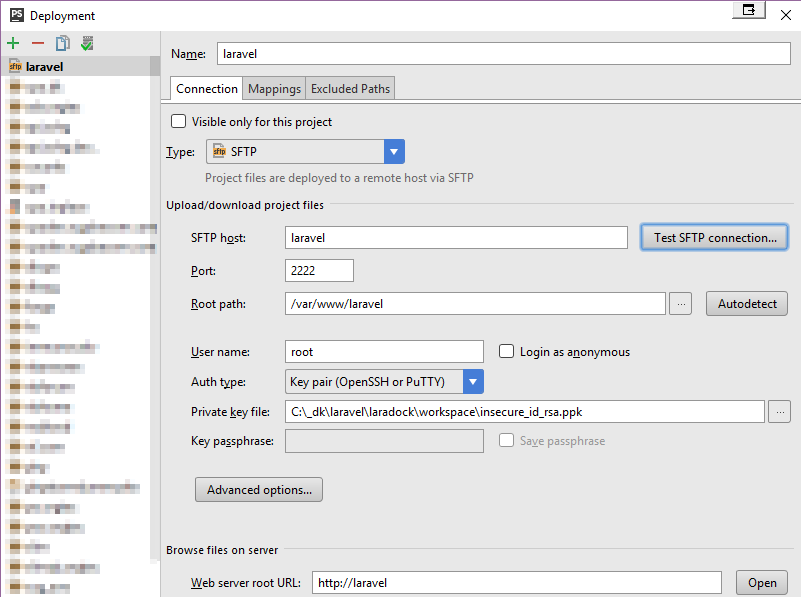
    
    - `Settings/BuildDeploymentConnectionMappings`
        - 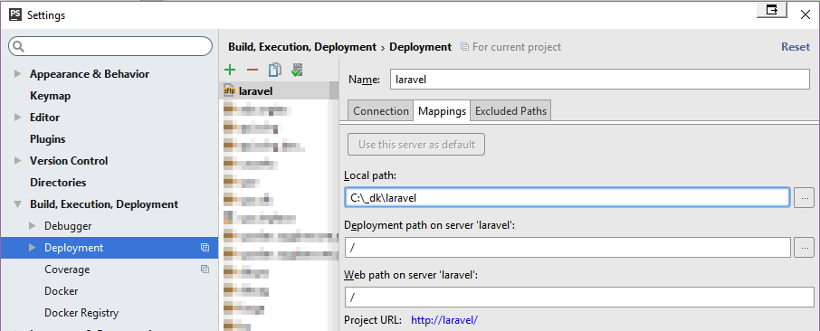
    
    - `Settings/BuildDeploymentDebugger`
        - 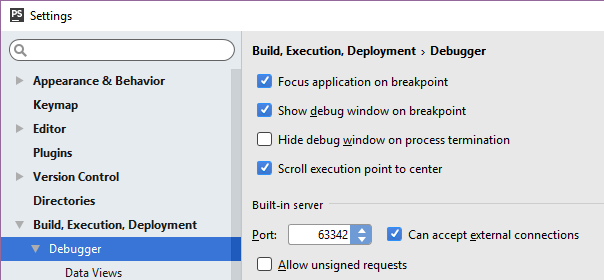
    
    - `Settings/EditRunConfigurationRemoteWebDebug`
        - 
    
    - `Settings/EditRunConfigurationRemoteExampleTestDebug`
        - 
    
    - `Settings/LangsPHPDebug`
        - 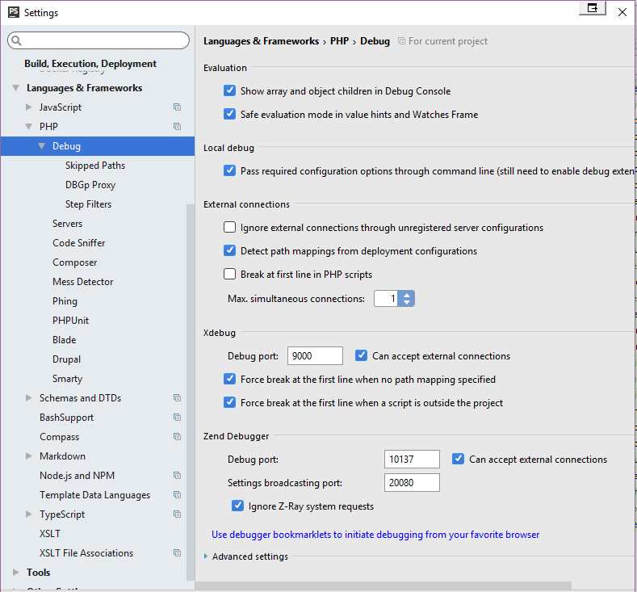
    
    - `Settings/LangsPHPInterpreters`
        - 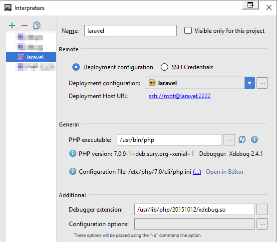
    
    - `Settings/LangsPHPPHPUnit`
        - 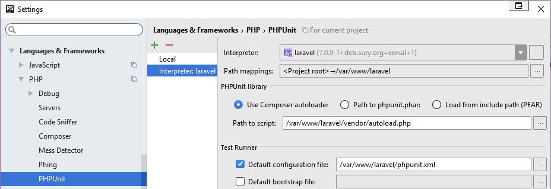
    
    - `Settings/LangsPHPServers`
        - 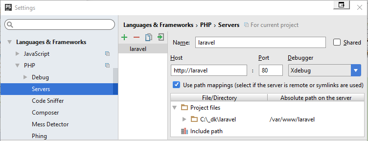
    
    - `RemoteHost`
        To switch on this view, go to: `Menu/Tools/Deployment/Browse Remote Host`.
        - 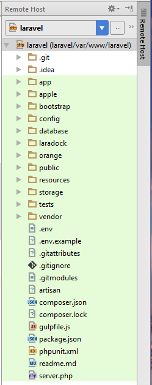
        
    - `RemoteWebDebug`
        - 

    - `EditRunConfigurationRemoteWebDebug`
        Go to: `Menu/Run/Edit Configurations`.
        - 

    - `EditRunConfigurationRemoteExampleTestDebug`
        Go to: `Menu/Run/Edit Configurations`.
        - 

    - `WindowsFirewallAllowedApps`
        Go to: `Control Panel\All Control Panel Items\Windows Firewall\Allowed apps`.
        - 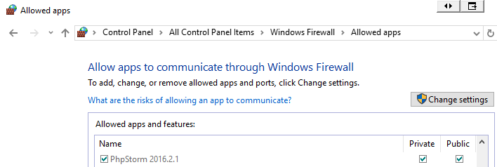

    - `hosts`
        Edit: `C:\Windows\System32\drivers\etc\hosts`.
        - 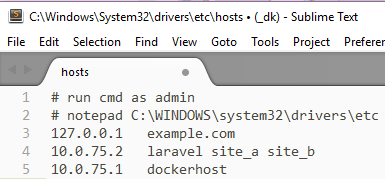

        - [Enable xDebug on php-fpm](#enablePhpXdebug)


<a name="Usage"></a>
## Usage

<a name="UsagePHPStormRunExampleTest"></a>
### Run ExampleTest
- right-click on `tests/ExampleTest.php`
    - Select: `Run 'ExampleTest.php'` or `Ctrl+Shift+F10`.
    - Should pass!! You just ran a remote test via SSH!

<a name="UsagePHPStormDebugExampleTest"></a>
### Debug ExampleTest
- Open to edit: `tests/ExampleTest.php`
- Add a BreakPoint on line 16: `$this->visit('/')`
- right-click on `tests/ExampleTest.php`
    - Select: `Debug 'ExampleTest.php'`.
    - Should have stopped at the BreakPoint!! You are now debugging locally against a remote Laravel project via SSH!
    - 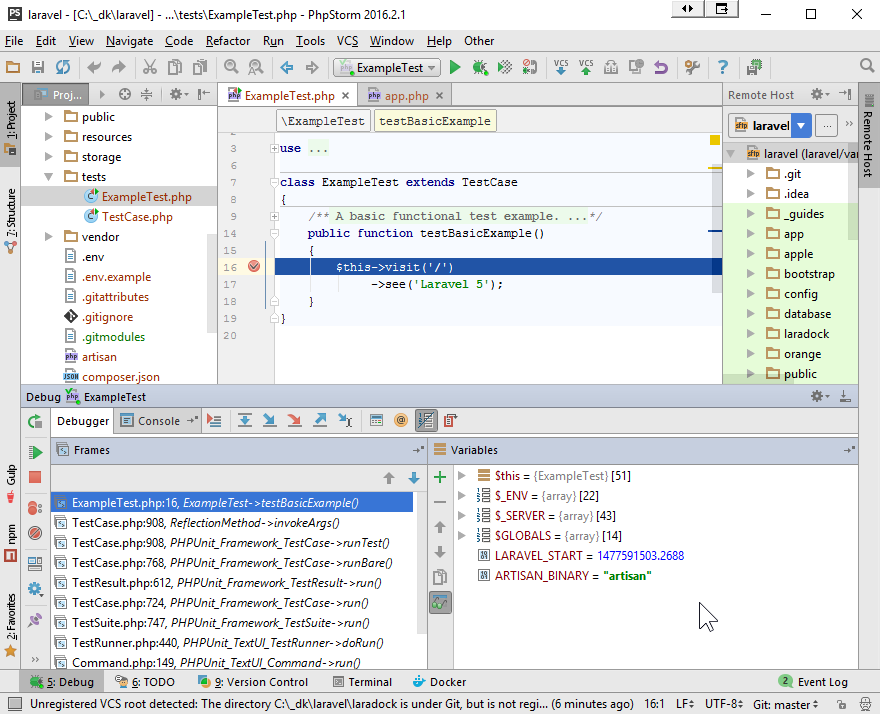


<a name="UsagePHPStormDebugSite"></a>
### Debug WebSite
- In case xDebug is disabled, from the `laradock` folder run: 
`./xdebugPhpFpm start`.
    - To switch xdebug off, run: 
`./xdebugPhpFpm stop`
    
- Start Remote Debugging
    - 
    
- Open to edit: `bootstrap/app.php`
- Add a BreakPoint on line 14: `$app = new Illuminate\Foundation\Application(`
- Reload [Laravel Site](http://laravel/)
    - Should have stopped at the BreakPoint!! You are now debugging locally against a remote Laravel project via SSH!
    - 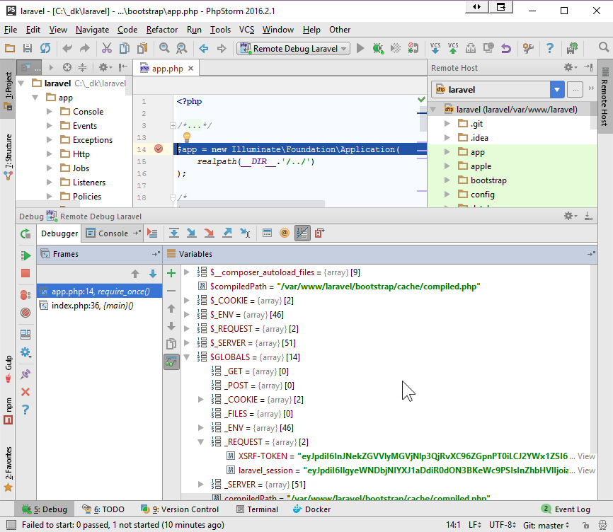


<a name="SSHintoWorkspace"></a>
#### Let's shell into workspace
Assuming that you are in laradock folder, type:
`ssh -i workspace/insecure_id_rsa -p2222 root@laravel`
**Cha Ching!!!!**
- `workspace/insecure_id_rsa.ppk` may become corrupted. In which case:
    - fire up `puttygen`
    - import `workspace/insecure_id_rsa`
    - save private key to `workspace/insecure_id_rsa.ppk`

<a name="InstallKiTTY"></a>

##### KiTTY
[Kitty](http://www.9bis.net/kitty/) KiTTY is a fork from version 0.67 of PuTTY.

- Here are some settings that are working for me:
    - 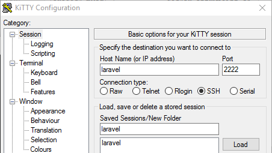
    - 
    - 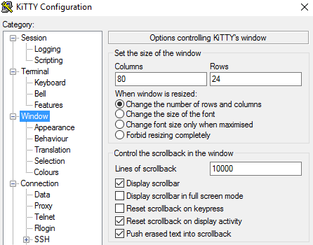
    - 
    - 
    - 
    - 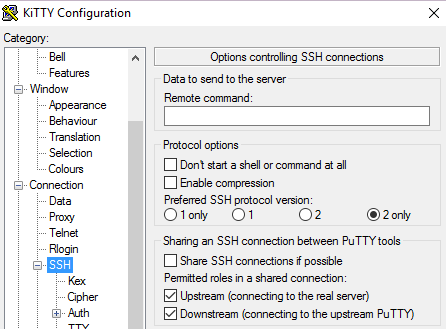
    - 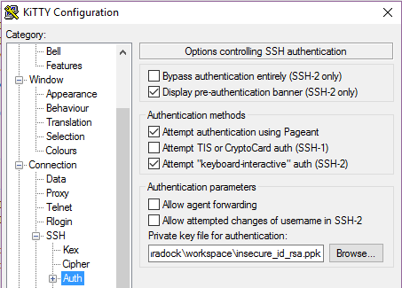
    - 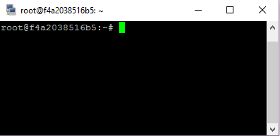


